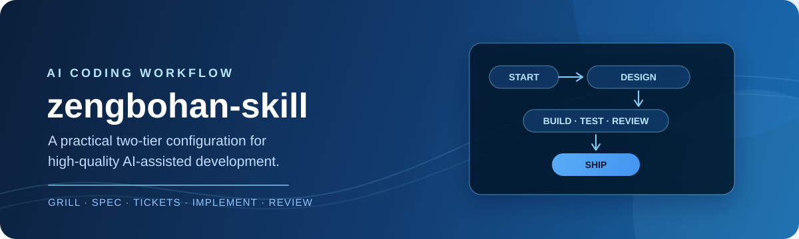

<p align="center">
  
</p>

<h1 align="center">zengbohan-skill</h1>

<p align="center">
  面向 AI 编程代理的自包含三档开发流水线 —— 一个文件夹，零 companion skills。
</p>

<p align="center">
  <a href="LICENSE"></a>
</p>

<p align="center">
  <a href="README.md">English</a> | 简体中文
</p>

## 它做什么

`zengbohan-skill` 是开发工作的单一入口 —— 一套流水线，两种深度。每个功能都走同样的四个 stage；你选的档位决定每个 stage 走多深，让仪式感跟着工作量走，而不是压过工作量。

| 档位 | 何时用 | 跑什么 |
| --- | --- | --- |
| **micro** | 错别字、文案微调、一行修复 | 直接改，不进流水线 |
| **standard**（默认） | 一个上下文窗口 / 一次坐下来能做完 | 并行摸底代码 → 一轮精简面试 → 一页 plan **一次批准** → 同会话 TDD 实现 → 一次评审 |
| **full** | 跨会话、跨天的大功能 | 多轮 grilling → 双门 plan（先内容、后切片）→ 按切片实现 → 双轴评审 |

签字点是刻意设计的：standard 只要**一次**批准（plan 把 seams、切片粒度、依赖边放在同一次交换里确认）；full **两次**（plan 内容，然后切片拆分）。环境事实永远不会变成问题抛回给你 —— 只有决策才问你，且每题都带推荐答案。

底层 stage：

| Stage | 定义 | 做什么 |
| --- | --- | --- |
| 1 | `stages/interview.md` | 并行探索代码库，再做设计树面试 —— 全程不落盘 |
| 2 | `stages/plan.md` | 把决策综合成 plan 文件（问题 + stories + seams + 带 `Verify:` 的切片），standard 一次批准、full 两道门 |
| 3 | `stages/implement.md` | 按预先约定的 seam 以 TDD 构建每个切片，每个一提交，边做边勾 plan |
| 4 | `stages/code-review.md` | 双轴评审（编码规范 + plan 忠实度），末尾产出交给你签字的验收清单 |

入口文件 `SKILL.md` 只负责分档和路由；规则只住在 `stages/` 里。stage 文件是普通 Markdown 文档，不是注册技能。

## 自包含设计

早期版本需要和本技能一起安装十个 companion skills。它们现在**内嵌并整合进 `stages/`**，在任何 harness 上装这一个文件夹就够。没有别的要装，也不会有版本不同步。

## 安装

仓库根目录**就是**技能文件夹 —— 直接 clone 进 skills 目录即可。本技能遵循 [Agent Skills](https://agentskills.io) 约定：文件夹里的 `SKILL.md` 带 YAML frontmatter（`name`、`description`），扫描 skills 目录的 harness 会自动发现它。

### Claude Code

```bash
git clone https://github.com/zeng-bohan/zengbohan-skill.git ~/.claude/skills/zengbohan-skill
```

### ZCode

```bash
git clone https://github.com/zeng-bohan/zengbohan-skill.git ~/.zcode/skills/zengbohan-skill
```

### Codex CLI

Codex 没有原生 skills 目录，通过 `AGENTS.md` 接入：

```bash
git clone https://github.com/zeng-bohan/zengbohan-skill.git ~/.codex/zengbohan-skill
```

然后在 `~/.codex/AGENTS.md`（或仓库级 `AGENTS.md`）里加上：

```markdown
## Development workflow

When the user invokes the zengbohan-skill pipeline (e.g. "/zengbohan-skill <task>"),
first read ~/.codex/zengbohan-skill/SKILL.md and follow its three-tier pipeline,
loading the stage files it references under stages/.
```

### 其他任何 harness

本技能就是纯 Markdown 加配套文件。clone 到代理能读到的任何位置，然后把 harness 的常驻指令文件指向入口：

```markdown
When the user invokes the zengbohan-skill pipeline (e.g. "/zengbohan-skill <task>"),
read <path-to>/zengbohan-skill/SKILL.md and follow it.
```

Cursor rules、Windsurf、Cline、opencode 或任何能注入指令的工具都适用。

> **Windows：** 把路径里的 `~/` 换成 `%USERPROFILE%\`。

安装后如果技能没有立刻出现，重启或刷新你的 harness。

## 使用

只做显式调用 —— 技能不会因 "develop"、按流程走 这类自然语言触发；想走流水线，点名调用：

```text
/zengbohan-skill 给 RAG 答案管线加引用溯源
```

技能会在回复第一行说明它选了哪个档位、为什么。决策点上你始终做主：面试轮次会停下来等你的答案，plan 文件也要你批准后才落盘。面试和 plan 共用一个上下文窗口，设计思路保持连贯；实现默认在同一会话继续，只在上下文紧张时才拆分。

## 仓库布局

```text
zengbohan-skill/          ← 仓库即技能；把这个文件夹 clone 进 skills 目录
├── SKILL.md              ← 入口 —— 分档 + 路由 + 出口条件
├── AGENTS.md
├── LICENSE
├── docs/
│   └── banner.svg
├── stages/               ← 四个 stage 定义（规则只住这里）
│   ├── interview.md
│   ├── plan.md
│   ├── implement.md
│   └── code-review.md
└── references/           ← stage 引用的操作配方
    ├── PHASE-BOUNDARIES.md
    ├── tests.md
    └── mocking.md
```

只有顶层 `SKILL.md` 叫 `SKILL.md`，所以 harness 只会注册一个技能。

## 设计原则

- **先设计后编码。** 重要决策要显式 —— 也只显式重要的那些。
- **仪式感跟着工作量走。** 签字点和流程按功能规模挣饭吃；一天的功能只批一次，不配一套独立的文书档案。
- **只落一个文件。** 整条流水线只产出 `.scratch/` 下的一份 plan，其余一切都活在对话里 —— 不写术语表、ADR、spec，也不拆 ticket 文件。
- **交付垂直切片。** 每个切片都应可独立验证。
- **测在 seam 上。** 优先测真实边界和失败模式的测试。
- **证据要求时才加复杂度。** 架构和诊断工具等代码库挣到了再用。

## 致谢

各 stage 定义整合自 Matt Pocock 的工程技能套件（[mattpocock/skills](https://github.com/mattpocock/skills)）—— `grilling`、`domain-modeling`、`grill-with-docs`、`to-spec`、`to-tickets`、`implement`、`tdd`、`code-review`、`setup-matt-pocock-skills`，以及 `ask-matt` 的阶段边界规则 —— 最近同步于 2026-09-24。上游还在持续增加新技能（`triage`、`prototype`、`pr`、`diagnosing-bugs`、`wayfinder`、`wizard`……）；这些**刻意不**内嵌 —— 需要就去 mattpocock/skills 装。打包、整合、三档流水线与自包含单入口设计：Bohan Zeng。

## 许可证

[MIT](LICENSE) © 2026 Bohan Zeng
